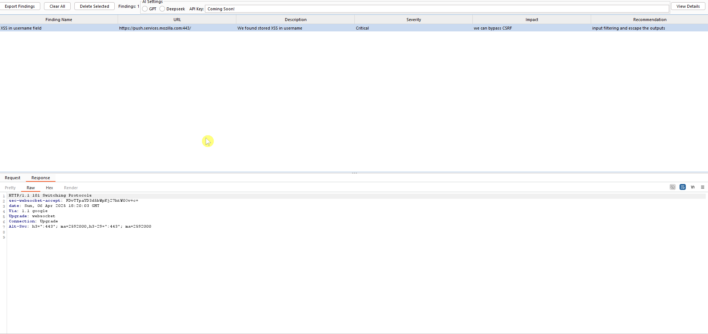
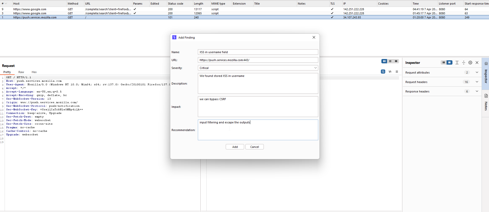
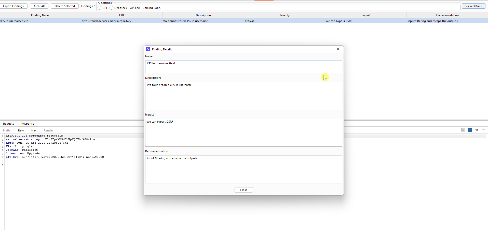
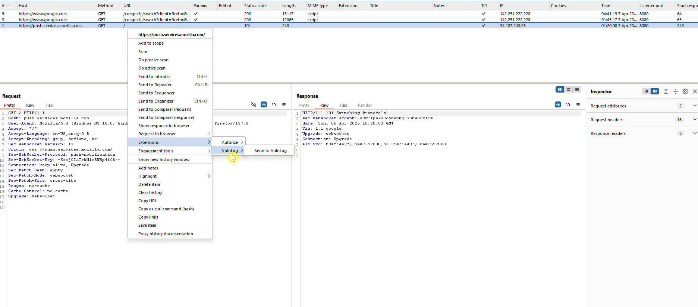

# VulnLog - Burp Suite Extension

VulnLog is a powerful Burp Suite extension designed to help security researchers track and manage vulnerabilities during penetration tests and security assessments. It provides a comprehensive interface for logging, managing, and documenting security findings.

## Screenshots

### Main Dashboard

*VulnLog's main interface showing the findings table and request/response views*

### Adding New Findings

*Dialog for adding new security findings with detailed fields*

### Detailed View

*Comprehensive view of finding details with full information*

### Extension Access

*Accessing VulnLog through Burp Suite's context menu*

## Features

### Core Functionality
- **Vulnerability Logging**: Capture and document findings directly from Proxy history and Repeater
- **Detailed Finding Management**:
  - Name, URL, and Severity tracking
  - Comprehensive description fields
  - Impact assessment documentation
  - Recommendation documentation
  - Full HTTP request/response storage
  - Availabe to view findings in issue tab

### User Interface
- **Rich Dashboard**:
  - Sortable findings table with tooltips for long text
  - Split-pane layout showing findings and request/response details
  - Quick access buttons for common actions
- **Finding Details**:
  - Dedicated dialog for viewing complete finding information
  - Edit capability through double-click
  - Tooltips for quick preview of long content
- **Context Menu Integration**: 
  - Right-click access in Proxy, Repeater, and Scanner
  - Quick "Send to VulnLog" option

### Data Management
- **Finding Operations**:
  - Add new findings with comprehensive details
  - Edit existing findings through double-click
  - Delete individual or all findings
  - Export findings to JSON format
- **Persistent Storage**: 
  - Maintains data between Burp sessions
  - Project-based organization by target host

### Severity Levels
- Critical
- High
- Medium
- Low
- Info

## Installation

1. Download the latest [Jython Standalone JAR](https://www.jython.org/download)
2. In Burp Suite:
   - Go to **Extender** > **Options**
   - Under **Python Environment**, select the Jython JAR file
3. Download `VulnLog.py` from this repository
4. Go to **Extensions** > **Installed** > **Add**
5. Select **Python** as the extension type
6. Choose the `VulnLog.py` file
7. Click Next

## Usage

### Adding Findings
1. Right-click any request in Proxy/Repeater/Scanner
2. Navigate to **Extensions** > **VulnLog** > **Send to VulnLog**
3. Fill in the finding details:
   - Name (required)
   - Severity level
   - Description
   - Impact
   - Recommendation

### Managing Findings
- Use the main dashboard to view all findings
- Double-click any finding to edit its details
- Use the toolbar buttons for:
  - Exporting findings
  - Clearing all findings
  - Deleting selected findings
- Click "View Details" for comprehensive information

### Viewing Details
- Select any finding to view its request/response
- Use tooltips for quick preview of long text
- Click "View Details" for full information display
- Double-click entries to edit them

### Exporting Data
- Click "Export Findings" to save as JSON
- Export includes:
  - Target information (host, port)
  - Finding details
  - Full request/response data
  - Evidence in both raw and encoded formats

## Upcoming Features
- AI integration with GPT and Deepseek support (UI elements already in place)
- Additional export formats (PDF, Word, XML, HTML)
- Enhanced finding templates
- Custom severity levels

## Contributing
Contributions are welcome! Please follow these steps:

1. Fork the repository
2. Create a feature branch (`git checkout -b feature/your-feature`)
3. Commit changes (`git commit -am 'Add some feature'`)
4. Push to branch (`git push origin feature/your-feature`)
5. Open a Pull Request

**Disclaimer**: This tool is intended for authorized security testing and educational purposes only. Always obtain proper authorization before testing systems.
